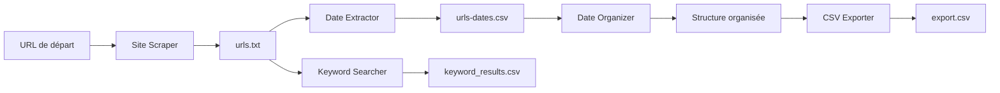

# Web Scraper Suite

Suite complète d'outils de scraping web avec interface graphique moderne pour l'extraction, l'organisation et l'export de données web.

## 🚀 Fonctionnalités

### Scraper de Site
- **Exploration automatique** : Crawling récursif avec détection sitemap XML
- **Filtrage intelligent** : Exclusion automatique des ressources statiques
- **Respect robots.txt** : Détection et respect des directives de crawling
- **Threading optimisé** : Scraping parallèle avec gestion des sessions HTTP
- **Limitation configurable** : Contrôle du nombre maximum d'URLs

### Extracteur de Dates
- **Patterns avancés** : Support formats français/anglais, ISO 8601, métadonnées
- **Sources multiples** : META tags, JSON-LD, microdata, contenu textuel
- **Threading haute performance** : Jusqu'à 50 threads concurrents
- **Pool de sessions** : Réutilisation des connexions HTTP
- **Extraction URL** : Détection dates dans les chemins d'URL

### Organisateur par Dates
- **Structure hiérarchique** : Organisation automatique année/mois
- **Gestion des anomalies** : Dossier séparé pour URLs sans date
- **Statistiques détaillées** : Métriques de distribution temporelle
- **Nomenclature française** : Noms de mois localisés

### Exporteur CSV
- **Formats multiples** : Export direct ou depuis structure organisée
- **Modes flexibles** : Fichier unique ou séparé par année
- **Format compatible** : Délimiteur `;`, quotes systématiques
- **Traitement par batch** : Optimisation mémoire pour gros volumes

### Recherche de Mots-clés
- **Patterns flexibles** : Support expressions exactes avec guillemets
- **Threading avancé** : Recherche parallèle optimisée
- **Contextes d'occurrence** : Extraction des passages pertinents
- **Statistiques granulaires** : Compteurs par mot-clé et URL

## 🏗️ Architecture

```
web-scraper-suite/
├── main.py                     # Point d'entrée GUI
├── no_console_launcher.py      # Lanceur sans console Windows
├── scraper/
│   ├── site_scraper.py         # Moteur de scraping principal
│   ├── date_extractor.py       # Extraction dates publication
│   └── keyword_searcher.py     # Recherche mots-clés
├── organizer/
│   ├── date_organizer.py       # Organisation hiérarchique
│   └── csv_exporter.py         # Export CSV multi-formats
├── ui/
│   └── modern_interface.py     # Interface graphique moderne
├── utils/
│   ├── common_utils.py         # Utilitaires partagés
│   └── logger_config.py        # Configuration logging
└── data/
    └── [domaine]/              # Données organisées par domaine
        ├── urls.txt
        ├── urls-dates.csv
        └── [année]/
            └── [mois]/
```

## 🔧 Technologies

- **Python 3.8+** : Langage principal
- **Tkinter/ttk** : Interface graphique native
- **requests** : Client HTTP optimisé
- **BeautifulSoup4** : Parsing HTML/XML
- **concurrent.futures** : Threading avancé
- **tqdm** : Barres de progression
- **dateutil** : Parsing dates flexible
- **fake-useragent** : Rotation User-Agent

## 📊 Workflow Standard



## 🎯 Cas d'Usage

### Veille Technologique
- Extraction automatisée de blogs techniques
- Organisation chronologique des articles
- Recherche de technologies spécifiques

### Analyse de Contenu
- Audit SEO avec extraction de métadonnées
- Cartographie temporelle de sites d'actualités
- Mining de contenus thématiques

### Research Data
- Constitution de corpus temporels
- Extraction de datasets web
- Analyse longitudinale de contenus

## 🚀 Démarrage Rapide

### Interface Graphique
```bash
python main.py
```

### CLI Direct
```bash
# Scraping
python scraper/site_scraper.py

# Dates
python scraper/date_extractor.py

# Mots-clés
python scraper/keyword_searcher.py
```

### API Programmatique
```python
from scraper.site_scraper import SiteScraper
from scraper.date_extractor import DateExtractor

scraper = SiteScraper("https://example.com", max_urls=5000)
urls = scraper.scrape()

extractor = DateExtractor("urls.txt", max_threads=20)
dates_found, total, output = extractor.run()
```

## ⚡ Performance

### Optimisations Implémentées
- **Pool de sessions HTTP** : Réutilisation connexions
- **Threading intelligent** : Auto-scaling selon charge système
- **Batch processing** : Traitement par lots optimisé
- **Streaming I/O** : Lecture/écriture non-bloquante
- **Regex précompilées** : Patterns de dates cachés

### Métriques Typiques
- **Scraping** : 50-100 pages/seconde (selon site)
- **Extraction dates** : 200-500 URLs/seconde
- **Export CSV** : 10K+ URLs/seconde
- **Recherche mots-clés** : 100-300 pages/seconde

## 🔒 Conformité

### Respect des Standards
- **robots.txt** : Lecture et respect automatique
- **Rate limiting** : Délais configurable entre requêtes
- **User-Agent rotation** : Simulation de navigateurs réels
- **SSL/TLS** : Support HTTPS complet

### Gestion d'Erreurs
- **Retry automatique** : Tentatives multiples sur échec
- **Timeout configurables** : Éviter les blocages
- **Logging détaillé** : Traçabilité complète des opérations
- **Fallback gracieux** : Dégradation progressive sur erreurs

## 📈 Monitoring

### Métriques en Temps Réel
- **Progression** : Barres de progression avec ETA
- **Vitesse** : Pages/seconde instantanée
- **Taux de succès** : Pourcentage de réussite
- **Statistiques détaillées** : Export JSON automatique

### Logs Structurés
```
2024-06-30 15:30:25 - INFO - SiteScraper - URLs trouvées: 1247
2024-06-30 15:30:26 - INFO - DateExtractor - Dates extraites: 892/1247 (71.5%)
2024-06-30 15:30:27 - INFO - URLDateOrganizer - Organisation: 15 années, 180 mois
```

## 🎨 Interface Moderne

### Design System
- **Material Design** : Palette de couleurs cohérente
- **Responsive Layout** : Adaptation automatique résolution
- **Dark Mode Ready** : Support thème sombre
- **Tooltips contextuelles** : Aide intégrée
- **Notifications** : Feedback utilisateur en temps réel

### UX Optimisée
- **Workflow guidé** : Suggestions d'étapes suivantes
- **Validation temps réel** : Vérification inputs
- **Raccourcis clavier** : Navigation rapide
- **Historique** : Restauration sessions précédentes

## 📚 Documentation

### API Reference
Chaque module expose une API cohérente avec callbacks de progression :
```python
def run(self, progress_callback=None):
    # progress_callback(current, total, message)
```

### Configuration Avancée
```python
# Headers personnalisés
headers = get_random_headers()
headers.update({'Custom-Header': 'Value'})

# Patterns de dates personnalisés
custom_patterns = [r'(\d{4})/(\d{2})/(\d{2})']

# Threading adaptatif
max_threads = min(20, os.cpu_count() * 2)
```

## 🤝 Contribution

### Architecture Modulaire
- **Plugins système** : Extensibilité par modules
- **Interfaces standardisées** : Contrats API cohérents
- **Tests intégrés** : Couverture des cas critiques
- **Documentation inline** : Docstrings complètes

### Standards Code
- **PEP 8** : Style guide Python
- **Type hints** : Annotations de types
- **Error handling** : Gestion d'exceptions robuste
- **Logging uniforme** : Standards de traces

## 📄 Licence

MIT License - Voir fichier LICENSE pour détails complets.

---

**🔗 Liens Utiles**
- [Guide Installation](INSTALL.md)
- [Documentation API](docs/api.md)
- [Exemples d'Usage](examples/)
- [Troubleshooting](docs/troubleshooting.md)